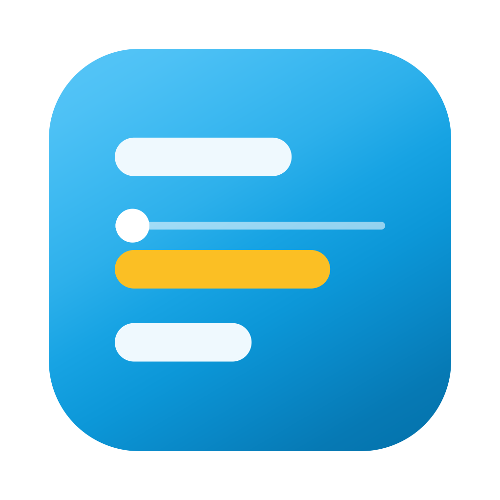

# Up Next

A small always-on-top macOS widget that shows today's calendar, so meetings stop
ambushing you mid-task. It sits in the corner of a monitor you choose, floats above
full-screen apps, appears on every Space, and never steals focus from whatever you are
typing in. There is no Dock icon — just a countdown to your next meeting in the menu bar.

It also keeps a TODO list beside the day: add one from anywhere with a global shortcut
(`⌃⌥T` by default, changeable in settings), tick it off, or roll it forward when today
gets away from you.

Everything runs on your own Mac. No server, no account to create, no analytics.

**[Homepage](https://upnextapp.co.uk/)** ·
**[Privacy policy](https://upnextapp.co.uk/privacy.html)** ·
**[Security overview](https://upnextapp.co.uk/security.html)**

---

## Install

> [!IMPORTANT]
> **Not yet.** The Homebrew tap below does not exist, and there is no release to
> download. Installing needs a signed and notarised build, which needs an Apple Developer
> account, which has not been bought. Until then the only way to run this is to
> [build it yourself](#run-it-yourself).

When it is published, installing will be:

```sh
brew install --cask edspressomartini/tap/up-next
```

and updating will be `brew upgrade`. There is deliberately no auto-updater: Homebrew
verifies a pinned hash for each release and macOS checks the signature on first launch,
so there is no update server to trust.

Requirements when it ships: **macOS on Apple silicon**, and a Google account.

### What is left before that works

| Step                                           | Status                                       |
| ---------------------------------------------- | -------------------------------------------- |
| Apple Developer Program, signing, notarisation | Not started — this is the blocker            |
| The tap repository and cask                    | Not created                                  |
| First tagged release                           | None yet; the release workflow has never run |
| Google OAuth consent screen published          | In progress                                  |

The full list, in dependency order, is in [`docs/launch-checklist.md`](docs/launch-checklist.md).

---

## Run it yourself

Building locally needs no Apple account and no signing. The app is ad-hoc signed, which
is enough for a binary you compiled on the machine you are running it on.

```sh
brew bundle                 # Node 24 and the rest of the toolchain
npm run setup               # install dependencies and the Electron binary
cp .env.example .env.local  # then add your own Google OAuth client
npm run dev
```

You need your own Google OAuth client, because the one this app ships with is tied to a
personal Google Cloud project. In the [Google Cloud console](https://console.cloud.google.com/):
create a project, enable the **Google Calendar API**, configure the OAuth consent screen
as **External**, and create an OAuth client of type **Desktop app**. Put the client ID and
secret in `.env.local`. The app requests two read-only scopes and nothing else:
`calendar.events.readonly` and `calendar.calendarlist.readonly`.

To produce a `.app` and a DMG for your own machine:

```sh
npm run package
```

If you copy that DMG to another Mac it will be blocked by Gatekeeper, because it is not
notarised. That is the problem the Apple Developer account solves.

---

## Security

The short version: two read-only Google scopes, a refresh token encrypted by the macOS
Keychain and bound to the app's code signature, calendar content held in memory and never
written to disk, outbound traffic to Google's endpoints and nowhere else, no telemetry,
no crash reporting, no auto-updater. The UI is fully sandboxed with no Node and no network
access, and every message it sends to the privileged process is schema-validated and
origin-checked.

The [security overview](https://upnextapp.co.uk/security.html) is
written for someone deciding whether to allow this on a managed Mac. The threat model,
the attack surface table and the reasoning behind each control are in
[`docs/spec.md`](docs/spec.md) §8.

Found a vulnerability? Please report it privately rather than opening an issue.

---

## Development

| Command           | What it does                                                         |
| ----------------- | -------------------------------------------------------------------- |
| `npm run dev`     | Run the app with hot reload                                          |
| `npm run check`   | Typecheck, lint, format check and tests — run this before committing |
| `npm test`        | Vitest, 220 tests                                                    |
| `npm run package` | Build a local unsigned DMG                                           |

Node 24 is required and enforced; `npm run dev` fails fast on anything else.

The app is Electron 44, React 19, TypeScript 6 and Tailwind 4. The privileged process
owns all state and the clock, and pushes finished view models to the UI, which derives
nothing. Adding a message channel means a schema, a sender check and a row in the table
in `docs/spec.md` §8.5 — the three exist together or the channel does not ship.

[`docs/spec.md`](docs/spec.md) is the design document: the structure, the visual language,
the security model, and a final section recording every deviation from the original plan
and why. It is worth reading before changing anything structural.

## Status

Version 0.1.0. Runs daily against a real calendar in development. Nothing has been
signed, packaged for distribution, or installed by anyone else yet.
